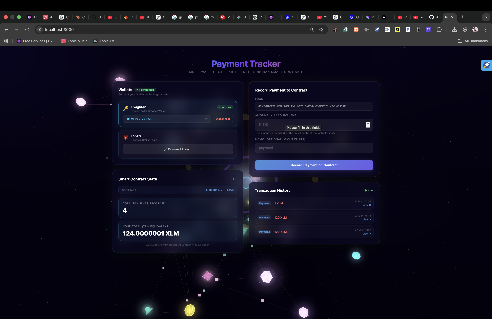
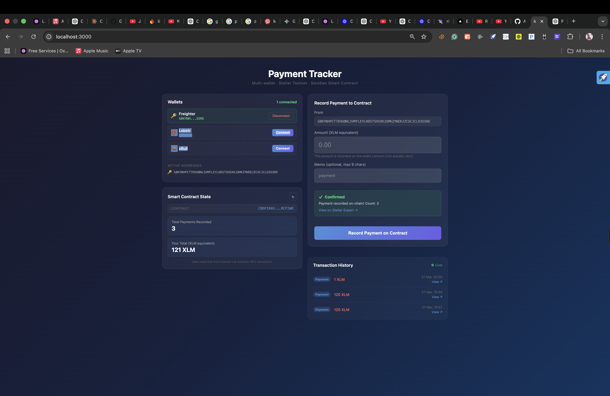
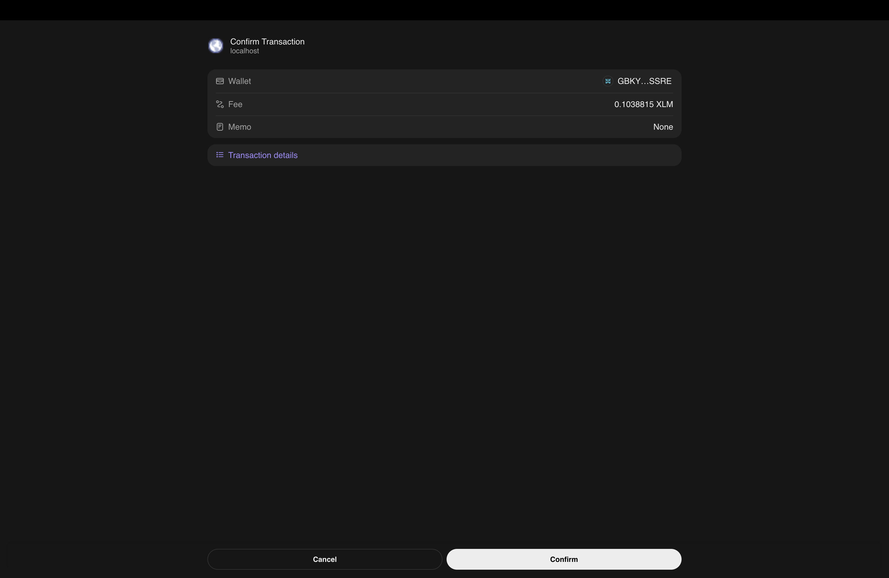
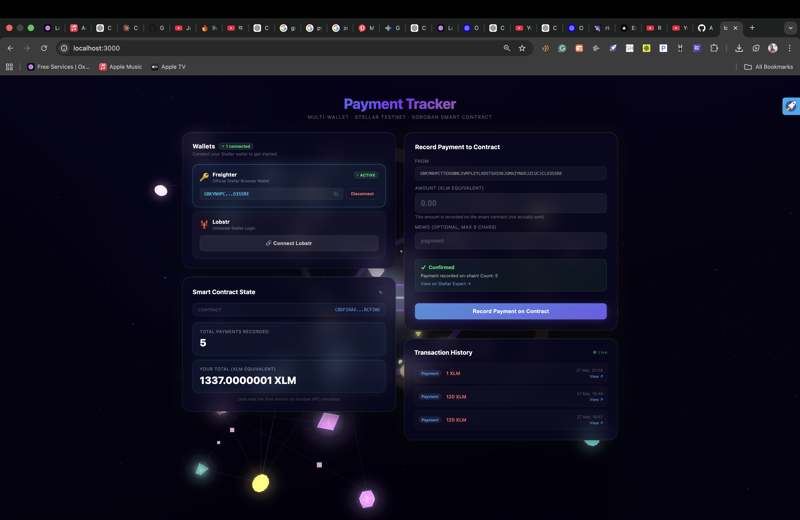
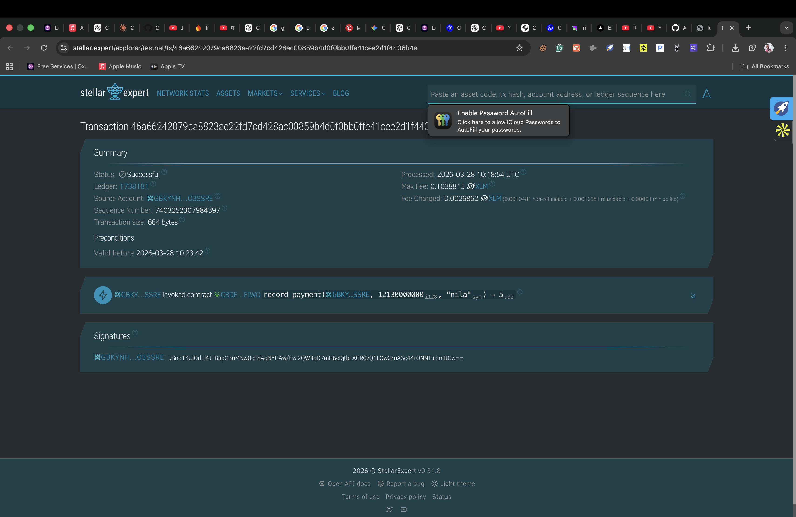

# Stellar Payment Tracker — Level 2

A full-stack decentralized payment tracking application built on the **Stellar blockchain** with **Soroban smart contracts**. Features multi-wallet support, real-time transaction history, on-chain payment recording, and a premium 3D glassmorphism UI.

---

## Screenshots

### Full App — Multi-Wallet Connected + 3D Background


### Wallet Panel + Smart Contract State + Transaction History


### Freighter Wallet — Transaction Confirmation Popup


### Payment Recorded — Confirmed Status + Updated Contract State


### On-Chain Proof — Stellar Expert Explorer


---

## Live Demo

> Run locally — see [Setup Instructions](#setup-instructions) below.

---

## What This App Does

1. **Connect multiple Stellar wallets** (Freighter + Lobstr) simultaneously via StellarWalletsKit
2. **Record payments on-chain** by invoking a deployed Soroban smart contract
3. **Read live contract state** — total payment count and per-user XLM total
4. **Stream real-time transaction history** from Stellar Horizon SSE
5. **Track transaction status** — pending → success / fail with explorer links
6. **Render a premium 3D animated background** built with Three.js and custom GLSL shaders

---

## Features

### Multi-Wallet Support
- Connect **Freighter** and **Lobstr** at the same time
- Per-wallet address display with one-click copy
- Active / Disconnect controls per wallet
- Graceful install prompts when extension is not detected

### Soroban Smart Contract Integration
- **Record payments** — invokes `record_payment(from, amount, memo)` on-chain; requires wallet signature
- **Read payment count** — simulates `get_payment_count()` without submitting a transaction
- **Read user total** — simulates `get_user_total(address)` to show your cumulative XLM recorded
- Full transaction lifecycle: build → sign (in wallet) → submit → poll → confirm

### Transaction Status Tracking
- Live status badge: `Pending` (spinner) → `Success` ✓ / `Failed` ✕
- Shows transaction hash and direct Stellar Expert explorer link
- Error classification: insufficient balance, wallet not found, user rejected

### Real-Time Transaction History
- Streams all payments for the connected address using Horizon SSE (`cursor: 'now'`)
- New entries animate in with a green highlight
- Shows sender, receiver, amount, asset, timestamp, and explorer link

### Premium 3D UI
- **Three.js background** — custom GLSL Fresnel shaders, crystal nodes, nebula sphere, network connection lines, flow particles, energy core, expanding torus rings, shooting stars, 5 500 dust particles, 3 orbiting point lights
- **Glassmorphism panels** — `backdrop-filter: blur(28px)`, per-panel accent glow borders (violet / cyan / gold / green)
- Responsive — mobile reduces particle/node counts for performance
- Fully SSR-safe via Next.js `dynamic(() => import(...), { ssr: false })`

---

## Tech Stack

| Layer | Technology |
|-------|-----------|
| Frontend | Next.js 14, React 18 |
| Blockchain | Stellar Testnet (Protocol 25) |
| Smart Contract | Soroban (Rust, `soroban-sdk 22`) |
| Stellar SDK | `@stellar/stellar-sdk ^14.6.1` |
| Wallet Kit | `@creit.tech/stellar-wallets-kit` |
| 3D Graphics | Three.js (custom GLSL shaders) |
| Styling | Plain CSS with glassmorphism |
| RPC | Soroban RPC Testnet |
| Horizon | Horizon Testnet (SSE streaming) |

---

## Project Structure

```
stellar-level-2/
├── components/
│   ├── BackgroundAnimation.js   # Three.js 3D scene (GLSL shaders, particles, crystals)
│   ├── WalletPanel.js           # Multi-wallet connect/disconnect UI
│   ├── PaymentForm.js           # Payment recording form (contract write)
│   ├── ContractPanel.js         # Contract state reader (count + user total)
│   ├── TxStatusBadge.js         # Pending / Success / Fail status indicator
│   ├── TransactionHistory.js    # Real-time Horizon SSE payment feed
│   └── PaymentTrackerApp.js     # Root layout — wires all panels together
│
├── contracts/
│   └── payment_tracker/
│       ├── src/lib.rs           # Soroban smart contract (Rust)
│       └── Cargo.toml           # soroban-sdk 22 dependency
│
├── lib/
│   ├── contract.js              # All Soroban RPC calls (simulate + submit + poll)
│   └── wallets-kit.js           # StellarWalletsKit wrapper (detect / connect / sign)
│
├── pages/
│   ├── _app.js                  # Next.js app entry
│   └── index.js                 # Home page (loads BackgroundAnimation + PaymentTrackerApp)
│
├── styles/
│   └── globals.css              # Full glassmorphism design system
│
├── next.config.js               # transpilePackages for wallets-kit
└── package.json
```

---

## Smart Contract

### Deployed on Stellar Testnet

**Contract ID:** `CBDFIRAVWEWFGSV3ZSEEJNPNKT6TZGQ4PXIYDEQM626XNTF2STRCFIWO`

**Network:** Stellar Testnet (Protocol 25)

**RPC Endpoint:** `https://soroban-testnet.stellar.org`

### Contract Functions

| Function | Type | Description |
|----------|------|-------------|
| `record_payment(from: Address, amount: i128, memo: Symbol) → u32` | Write | Records a payment on-chain. Requires `from` authorization. Returns new total count. |
| `get_payment_count() → u32` | Read | Returns the total number of payments recorded globally. |
| `get_user_total(user: Address) → i128` | Read | Returns the cumulative amount (in stroops) recorded for a given address. |
| `get_payment(index: u32) → Option<PaymentRecord>` | Read | Returns a specific payment record by index. |

### Storage Layout

| Storage | Key | Value | Purpose |
|---------|-----|-------|---------|
| Instance | `COUNT` (Symbol) | `u32` | Global payment count |
| Instance | `0, 1, 2, …` (u32) | `PaymentRecord` | Indexed payment records |
| Persistent | `Address` | `i128` | Per-user running total (in stroops) |

### PaymentRecord Type

```rust
pub struct PaymentRecord {
    pub from:      Address,   // Wallet address that authorized the payment
    pub amount:    i128,      // Amount in stroops (1 XLM = 10_000_000 stroops)
    pub timestamp: u64,       // Ledger timestamp at recording time
    pub memo:      Symbol,    // Short memo (≤ 9 chars)
}
```

### Build & Deploy

```bash
# Requires Rust + wasm32-unknown-unknown target + stellar CLI

# Build the contract
cd contracts/payment_tracker
cargo build --target wasm32-unknown-unknown --release

# Deploy to testnet (requires funded identity "deployer")
stellar contract deploy \
  --wasm target/wasm32-unknown-unknown/release/payment_tracker.wasm \
  --source deployer \
  --network testnet

# Test — read payment count
stellar contract invoke \
  --id CBDFIRAVWEWFGSV3ZSEEJNPNKT6TZGQ4PXIYDEQM626XNTF2STRCFIWO \
  --source deployer \
  --network testnet \
  -- get_payment_count
```

---

## Architecture

### Transaction Flow

```
User fills form
      │
      ▼
buildRecordPaymentTx()          ← lib/contract.js
  loadAccount(Horizon)
  new TransactionBuilder(...)
  contract.call("record_payment", ...)
  rpc.simulateTransaction(tx)   ← injects auth + footprint
  rpc.assembleTransaction(tx, sim)
      │
      ▼
signTx(walletId, xdr, passphrase)  ← lib/wallets-kit.js
  StellarWalletsKit.setWallet(id)
  StellarWalletsKit.signTransaction(xdr)
  → wallet extension prompts user
      │
      ▼
submitAndPoll(signedXdr, onStatusUpdate)  ← lib/contract.js
  rpc.sendTransaction(signedXdr)
  poll rpc.getTransaction(hash) every 2s
  → onStatusUpdate("pending" | "success" | "fail")
      │
      ▼
UI updates: TxStatusBadge + ContractPanel refresh
```

### Wallet Detection Flow

```
WalletPanel mounts
      │
      ▼
detectWallets()
  StellarWalletsKit.init({ network: TESTNET, modules: [FreighterModule, LobstrModule] })
  StellarWalletsKit.refreshSupportedWallets()
  → returns [{ id, name, available, installUrl, … }]
      │
      ▼
Render wallet cards
  available=true  → Connect button
  available=false → Install link (opens extension store)
```

### Key SDK Notes

- **SDK v14.6.1 required** — Stellar testnet runs Protocol 25. SDK v12 throws `"Bad union switch: 4"` XDR deserialization errors.
- **`StellarSDK.rpc.*`** — In v14, `SorobanRpc` namespace was renamed to `rpc`. All simulation and polling uses `StellarSDK.rpc.Server`, `StellarSDK.rpc.assembleTransaction`, `StellarSDK.rpc.Api.GetTransactionStatus`.
- **Static wallet kit methods** — `StellarWalletsKit` only exposes static methods (`StellarWalletsKit.init()`, `.setWallet()`, `.selectedModule.getAddress()`, `.signTransaction()`). Do not instantiate it.
- **Simulation source account** — Read-only simulations use a dummy `Account` with sequence `'0'` — no on-chain lookup needed since simulations are never submitted.

---

## Setup Instructions

### Prerequisites

- Node.js 18+
- A Chromium browser with [Freighter](https://freighter.app) or [Lobstr](https://lobstr.co/universal-login) extension installed
- Freighter configured for **Testnet** (Settings → Network → Testnet)

### Installation

```bash
# Clone the repository
git clone https://github.com/ANSHSINGH5999/stellar-level-2.git
cd stellar-level-2

# Install dependencies
npm install
```

### Development

```bash
npm run dev
```

Open [http://localhost:3000](http://localhost:3000)

### Production Build

```bash
npm run build
npm run start
```

### Running Tests

```bash
npm test
```

---

## How to Use

1. **Open the app** at `http://localhost:3000`
2. **Connect your wallet** — click the Freighter or Lobstr connect button in the Wallets panel. Approve the connection in your wallet extension.
3. **Make sure you have Testnet XLM** — use [Stellar Friendbot](https://friendbot.stellar.org/?addr=YOUR_ADDRESS) to fund your testnet address.
4. **Record a payment**:
   - Select XLM in the asset dropdown
   - Enter an amount (e.g. `0.01`)
   - Optionally add a memo (max 9 characters)
   - Click **Record Payment**
   - Approve the transaction in your wallet extension
   - Watch the status badge update: Pending → Success
5. **View contract stats** — the Contract State panel shows the total payment count and your personal total (in XLM)
6. **View history** — the Transaction History panel streams live payments for your address from Horizon

---

## Git History

```
c202c6b  style: highlight cards with colored borders/glow and increase card sizes
77df0f5  feat: premium UI/UX redesign with 3D Three.js background and glassmorphism
d60dd56  fix 'Bad union switch: 4' by upgrading stellar-sdk to v14
22bebff  fix runtime bugs: correct wallets-kit API and simulation source
2fb030d  fix WalletNetwork import and unused Rust Vec import
6fef001  deploy Soroban payment tracker contract and wire frontend
09c216e  add multi-wallet payment tracker: StellarWalletsKit integration
```

---

## Environment / Config

No `.env` file is needed. All network endpoints and the contract ID are hardcoded for Stellar Testnet in `lib/contract.js`:

```js
export const CONTRACT_ID     = 'CBDFIRAVWEWFGSV3ZSEEJNPNKT6TZGQ4PXIYDEQM626XNTF2STRCFIWO';
export const SOROBAN_RPC_URL = 'https://soroban-testnet.stellar.org';
export const HORIZON_URL     = 'https://horizon-testnet.stellar.org';
export const NETWORK_PASSPHRASE = StellarSDK.Networks.TESTNET;
```

---

## License

MIT
